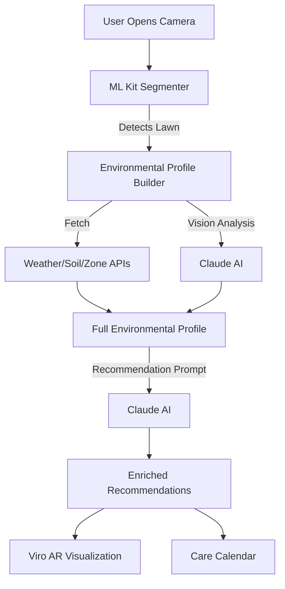

# GreenScape 🌿 — AI-Powered Lawn Scanning & AR Plant Recommendation App


**GreenScape** is a next-generation gardening assistant that turns your phone into a horticultural powerhouse. By scanning your yard, gathering real-time environmental data, and leveraging state-of-the-art AI, GreenScape recommends the perfect plants for your specific microclimate and lets you visualize them in your yard using Augmented Reality.

---

## 🚀 Vision
Most people struggle to know what to plant in their yard. They buy beautiful plants that die within weeks because the soil is wrong, the sun is too intense, or they miss a watering day. **GreenScape** eliminates the guesswork by analyzing 20+ environmental data points to ensure your garden thrives.

## ✨ Key Features

- **🔍 Intelligent Lawn Scanning**: Real-time camera feed with on-device ML segmentation to identify plantable areas.
- **🌍 360° Environmental Profile**: Automatically aggregates soil composition, drainage, pH, hardiness zones, frost dates, and local weather forecasts via GPS.
- **🧠 AI-Driven Recommendations**: Uses **Claude (LLM)** to reason about your specific environmental profile and recommend 6-8 ranked plant species.
- **👓 AR Visualization**: Place life-sized 3D models of recommended plants in your actual yard to see how they look at maturity.
- **📅 Personalized Care Schedule**: Week-by-week tasks (watering, pruning, fertilizing) adapted to your local weather forecast.
- **📈 Environmental Impact Dashboard**: Track your yard's contribution to carbon sequestration, water savings (vs. turf lawns), and biodiversity.

---

## 🛠️ Tech Stack

### Frontend (Mobile)
- **Framework**: React Native with **Expo SDK 54**
- **AR Engine**: **ViroReact** (ARKit/ARCore)
- **Styling**: **NativeWind** (Tailwind CSS for React Native)
- **State Management**: **Zustand** (with persistence)
- **Data Fetching**: **TanStack Query** (React Query)
- **Navigation**: **Expo Router** (File-based routing)

### Backend & AI
- **Platform**: **Supabase** (Postgres, Edge Functions, Storage)
- **AI Models**: 
  - **Anthropic Claude (Daedalus API)** for vision analysis and plant reasoning.
  - **Google ML Kit** for on-device scene segmentation.
- **External APIs**: 
  - Open-Meteo (Weather)
  - USDA Web Soil Survey (Soil)
  - Perenual API (Plant Database)
  - Google Places (Nurseries)

---

## 🏗️ Architecture: The Brain of GreenScape



---

## ⚙️ Project Structure

```text
/app             - Expo Router file-based navigation
  /(tabs)        - Main dashboard (Scan, Plants, Care, Impact)
  /ar            - Augmented Reality placement screens
  /plant         - Detailed plant info sheets
/components      - Reusable UI, Camera, and AR modules
/lib             - Core logic: API wrappers, State Stores, AR Helpers
/supabase        - Edge Functions (Profile assembly, AI logic)
/constants       - Theme, Colors, and Static Mapping
```

---

## 🚦 Getting Started

### Prerequisites
- Node.js (v18+)
- Expo Go (for basic testing) or **Prebuild** for AR features
- Supabase account

### Installation

1. **Clone the repository**:
   ```bash
   git clone https://github.com/your-repo/GreenScape.git
   cd GreenScape
   ```

2. **Install dependencies**:
   ```bash
   npm install
   ```

3. **Set up environment variables**:
   Create a `.env` file in the root:
   ```bash
   EXPO_PUBLIC_SUPABASE_URL=your_supabase_url
   EXPO_PUBLIC_SUPABASE_ANON_KEY=your_supabase_key
   ```

4. **Run the app**:
   ```bash
   npx expo start
   ```
   *Note: AR features require a physical device and a development build (`npx expo run:ios` or `npx expo run:android`).*

---

## 🧬 Environment Data Sources
| Data Point | Source |
|------------|--------|
| **Soil Texture/pH** | USDA Web Soil Survey |
| **Hardiness Zone** | USDA Plant Hardiness API |
| **Weather Metrics** | Open-Meteo |
| **Frost Dates** | NOAA Climate Data |
| **Plant Taxonomy** | Perenual API |

---

## 📸 Screenshots & Demo
*(Add your screenshots here)*

---

## 🤝 The Team
Built for **IrvineHacks 2026** by the GreenScape Team.

---

## 📄 License
This project is licensed under the MIT License - see the [LICENSE](LICENSE) file for details.
